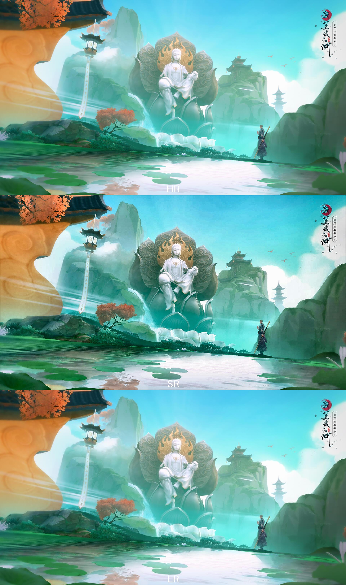
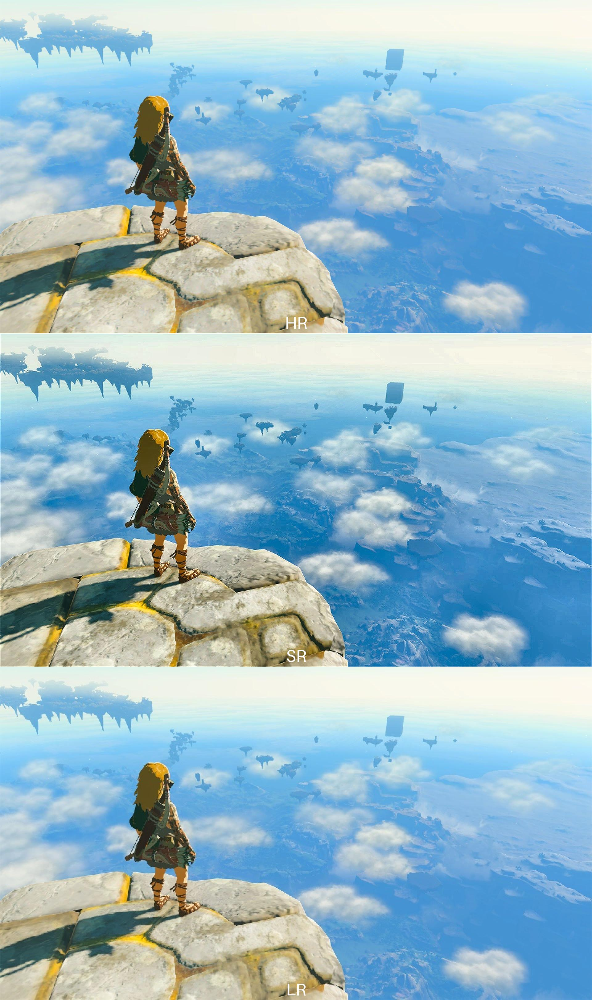

# Edge Device Realtime SuperResolution based on eSR

## Introduction
This project is based on [eSR](https://github.com/pnavarre/eSR). Added interface for RGB image and video input and output, support more image enhancement methods and estimation of the model's performance on both cpu and gpu.

## Run project
1. Environment setup
```bash
pip install -r requirements.txt
```

2. Run the project
```bash
python run.py
```

## demo
- image



- mp4 [demo](./images/compared1.mp4)
